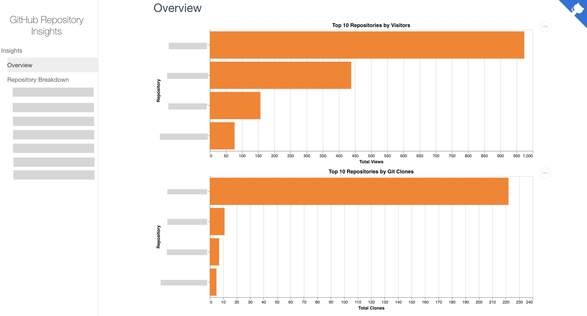
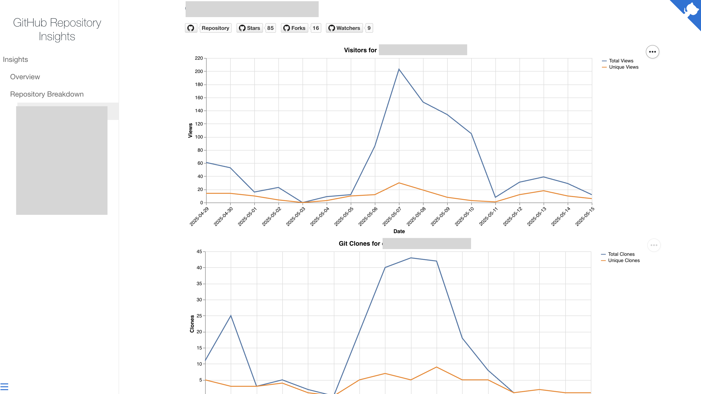

# GitHub Repository Insights

This GitHub Action collects insights data from GitHub for specified repositories, including views, clones, and referral sources. It saves raw and merged data in the repository and generates Markdown reports for GitHub Pages, enabling long-term tracking beyond GitHub's 14-day limitation.





## Inputs

- `repos` (required): Comma-separated list of repositories (e.g., `owner/repo1,owner/repo2`).
- `pat-token` (required): GitHub fine-grained personal access token with `administration:read` permission for the listed repositories.

## Outputs

This Action generates:

- Raw data in `docs/data/raw/`.
- Processed data in `docs/data/`.
- A Markdown report in `docs/README.md`.

## Example Usage

```yaml
name: Generate Insights

on:
  schedule:
    - cron: "0 1 * * *" # Runs daily
  workflow_dispatch: # Allows manual triggering

jobs:
  generate-insights:
    runs-on: ubuntu-latest

    steps:
      - name: Checkout repository
        uses: actions/checkout@v4
        with:
          ref: insights
          fetch-depth: 0

      - name: Ensure 'insights' branch exists
        run: |
          git fetch origin insights || echo "No 'insights' branch found"
          git checkout insights || git checkout -b insights

      - name: Generate GitHub Insights
        uses: emillg/github-repo-insights@v1.1.0
        with:
          repos: "owner/repo1,owner/repo2"
          pat-token: ${{ secrets.PAT_TOKEN }}

      - name: Commit and push insights
        run: |
          git config user.name "github-actions[bot]"
          git config user.email "github-actions[bot]@users.noreply.github.com"
          git add -A
          git commit -m "Update GitHub Insights" || echo "No changes to commit"
          git push origin insights
```

## GitHub Pages

To make the generated insights accessible as a GitHub Pages site:

1. Go to your repository on GitHub.
2. Navigate to **Settings** > **Pages**.
3. Under **Branch**, select the `insights` branch and set the directory to `/docs`.
4. Click **Save**.

Once enabled, your insights will be available at `https://<your-username>.github.io/<repository-name>`.

## Local Testing

You can test this Action locally:

```bash
pip install -r requirements.txt

env INPUT_PAT-TOKEN=<your_personal_access_token> INPUT_REPOS="owner/repo1,owner/repo2" python github_insights.py
```

After generating the insights, you can test the MkDocs site locally:

```bash
npm i docsify-cli -g
docsify serve docs
```

Open the site in your browser: `http://localhost:3000`.
